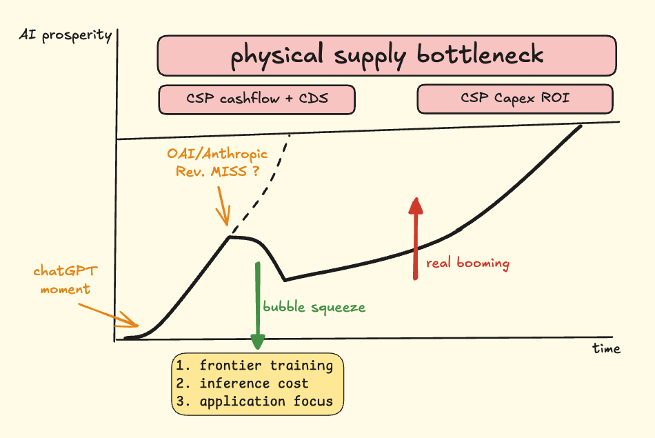

## 我们身处何方？

在我的观察里，世界从未如此极端有张力过，这是人类文明第一次接受“智能”标准化、商品化、规模化的冲击。极度繁荣与极度衰败混合，极度狂欢与极度悲观交织。在这样的世界里，迷失与不安是正常的，不过真正重要的是，我们应该如何理解当“智能”开始标准化、商品化、规模化，社会会发生什么样的剧变，这个过程应该如何演绎以及最应该关心的是——我们身处何方？
从哲学的第一性出发，我很难脱离三段论（否定之否定）去理解事物发展的逻辑。

## 头顶乌云的派对 & 钢丝起舞的灰犀牛
ChatGPT的确是整个AI行业划时代的流星，它揭开了这场派对真正的序幕。所有人都为AI而狂欢，大街小巷很难不听到公众对AI的讨论。所有与AI相关的行业，景气度攀升。所有与AI不相关的行业，被之前的经济周期掣肘。派对声音越来越大，没有人知道这场派对什么时候结束，也没有人知道，在钢丝中起舞的灰犀牛何时袭来。随着模型能力跨过起点，AI硬件供应链与Token同时涨价，似乎质疑AI发展的声音越来越不可见。整场派对的声音开到最大。但这并没有改变一个事实：模型的进步与模型公司的收入增长将成为支撑整个产业的唯一基石。

## 翻手为云，覆手为雨
这一阶段，模型公司，尤其是全球最领先的模型公司，将承担翻手为云覆手为雨的角色。当OpenAI、Anthropic跨过那个奇点，收入与模型能力不断提升，那能够制约整个AI发展速度的就只有大厂的现金流与发债能力，以及他们计算Capex ROI的账本。

翻手云：即使在2028年最重要的节点，他们可以实现一切财务报表上的闭环，那也难挡物理供应瓶颈带来的结构性通胀，最终总会迎来ROI的平衡点。这是最顺利的情形。在ChatGPT Moment之后，整个LLM行业头也不回地发展到了一个前所未有的繁荣阶段，然后持续地扩展。

覆手雨：如果在2028年最重要的节点，所有的CSP厂商没有证明这一轮Capex能够持续转化为收入、现金流和用户真实付费，那问题就不再是“模型还会不会进步”，而是“谁来继续买单”。资本市场可以为想象力付费一段时间，但不能永远为未兑现的产能付费。债务可以把时间往后推，不能把物理约束消掉。

这里的灰犀牛不是模型停滞。模型停滞反而是最容易理解的风险。更麻烦的是模型仍然进步，算力仍然扩张，收入也仍然增长，但每一步增长都需要更重的资本开支、更紧的供应链、更贵的电力、更复杂的调度。世界像一台不断升频的机器，性能还在提升，但散热已经开始追不上。是物理和资本否定了智能无限扩张的幻觉。智能一旦变成商品，就必须接受商品世界最朴素的约束：成本、供给、回收期、边际收益。

泡沫出清的过程也不全是坏事，在这个阶段，AI labs会更关注前沿模型训练方法的优化、推理成本的优化以及把更多注意力放在应用构建上，这三个方向都为未来更大的周期积蓄着更强的爆发力。

## 第二次诞生的真正繁荣

但我并不因此悲观。恰恰相反，真正的繁荣往往不是第一次爆炸，而是第二次诞生。

第一次诞生，是模型公司把智能从实验室里拽出来，让所有人看见它。那一刻是震撼，是ChatGPT Moment，是世界意识到“原来智能可以被制造”。但第一次诞生解决的是供给问题。它回答的是：世界上能不能出现一种标准化智能？

第二次诞生，要解决的是吸收问题。世界能不能把这种标准化智能塞进真实流程里，让它变成生产力，而不是变成一堆更会说话的软件？这才是最硬的问题。因为企业真正缺的不是一个能回答问题的东西，企业缺的是能完成任务、承担责任、融入组织的人。

模型公司像发电厂，先把电造出来。AIDC、芯片、网络、电力、散热，是发电厂背后的物理世界。应用公司像机器，把电接进去，让它驱动一个个具体动作。只有机器变多，电才不是库存。只有应用吃掉足够多的标准智能，模型公司的收入、CSP的Capex、硬件供应链的景气度，才有可能形成闭环。

这也是为什么我会把AI繁荣理解为一个三角博弈：物理、资本、应用。物理决定供给的上限，资本决定扩张的速度，应用决定回收的质量。三者缺一个，繁荣都会变形。物理太紧，价格通胀吞掉利润；资本太松，产能扩张先于需求；应用太弱，所有能力都停留在演示和订阅里，最后变成一场昂贵的注意力游戏。

否定之否定落在这里：AI先否定旧的人力结构，再被物理和资本否定，最后只有被应用重新肯定。这个重新肯定不是回到过去，而是让智能从“一个聪明的回答者”，变成“一个能被组织调度的生产要素”。

所以我们身处何方？大概处在第一次繁荣的尾部，第二次繁荣的门口。派对还在继续，乌云也确实在头顶。最好的位置，不是在舞池中央跟着音量摇晃，也不是站在门口预言崩塌。最好的位置，是去找那些能把标准智能接进真实机器的人。

因为下一轮真正的繁荣，不属于最会谈论AI的人。属于最会消化AI的人。
